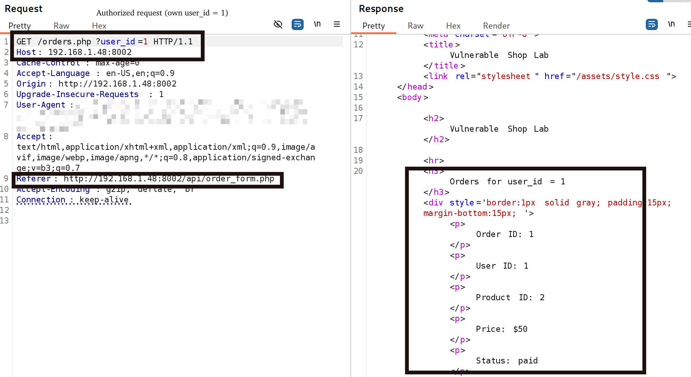
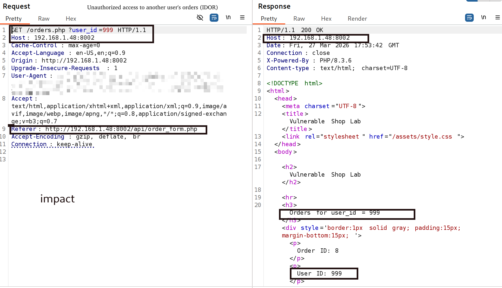
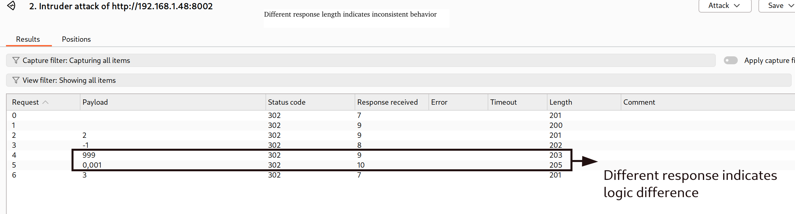
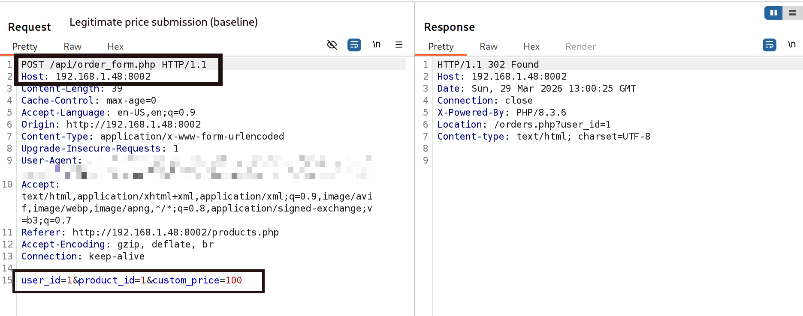
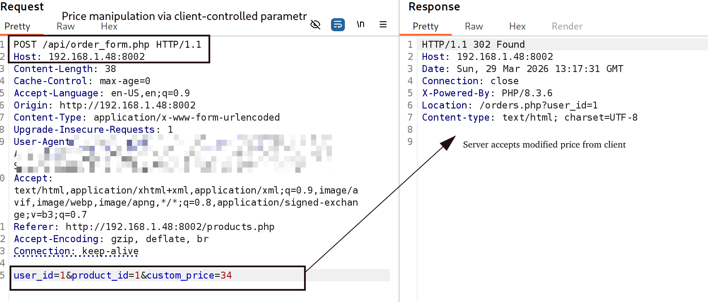
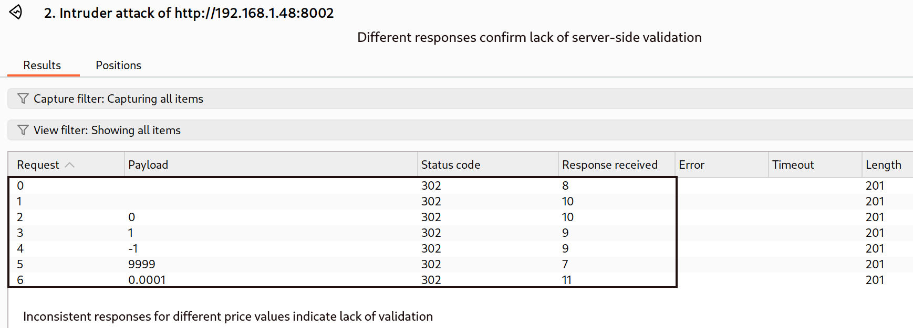
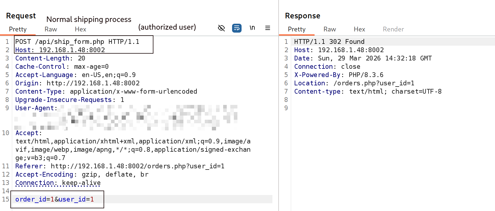
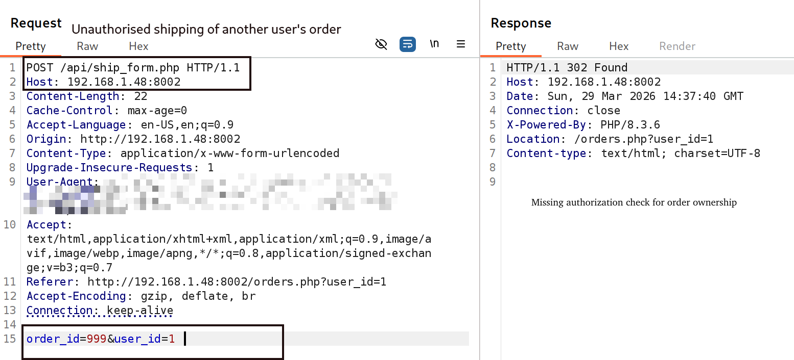
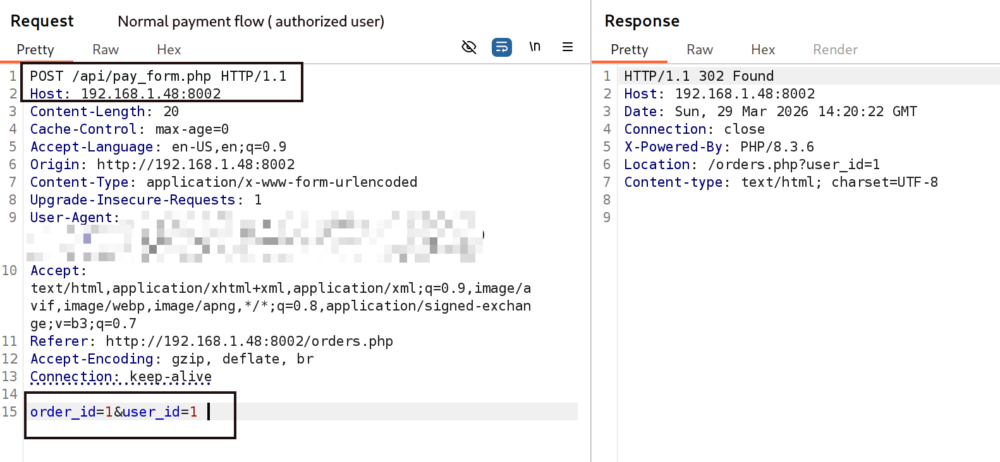
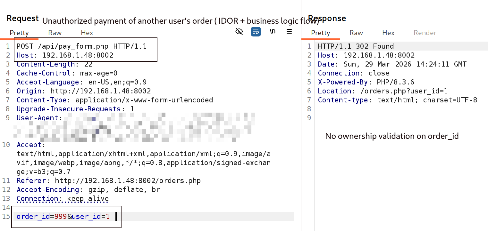

# 🛡️ IDOR & Business Logic Vulnerabilities Lab

## 📌 Overview
This project demonstrates practical exploitation of:
- IDOR (Insecure Direct Object Reference)
- Business Logic vulnerabilities

Tested in a custom vulnerable shop lab.

---

# 🔴 1. IDOR — Access to Other Users' Data

## ✅ Authorized request (baseline)
IDOR baseline

## ❌ Unauthorized access (IDOR)
IDOR attack

## 🔍 Intruder confirmation
IDOR intruder

---

# 💰 2. Price Manipulation

## ✅ Normal price submission
Price baseline

## ❌ Manipulated price
Price attack

## 🔍 Intruder fuzzing
Price intruder

---

# 🚚 3. Shipping Logic Abuse

## ✅ Normal shipping
Ship baseline

## ❌ Unauthorized shipping
Ship attack

---

# 💳 4. Payment Logic Abuse (IDOR + Business Logic)

## ✅ Normal payment
Pay baseline

## ❌ Unauthorized payment
Pay attack

---

# ⚠️ Impact

- Unauthorized access to other users' data
- Manipulation of order price
- Unauthorized order processing (shipping & payment)
- Lack of server-side validation
- Broken access control

---

# 🧠 Key Learning

- Always validate ownership on the server side
- Never trust client-controlled parameters
- Business logic must be strictly enforced

---

# 🛠️ Tools Used

- Burp Suite (Proxy, Repeater, Intruder)
- Browser DevTools
- Manual testing

---

# 👩‍💻 Author

Tatiana Trunova  
Junior Application Security / Pentester (in progress) 

---

# 🧪 Detailed Vulnerability Report (Bug Bounty Style)

---

# 🔴 1. IDOR — Unauthorized Access to Other Users' Orders

## 📌 Description
The application allows access to order data by modifying the `user_id` parameter in the request.

There is **no server-side validation** to verify that the authenticated user owns the requested data.

---

## 🔁 Steps to Reproduce

1. Log in as a normal user (e.g. user_id=1)
2. Intercept the request:
```
GET /orders.php?user_id=1
```
3. Modify the parameter:
```
GET /orders.php?user_id=999
```
4. Send the request

---

## 📸 Proof of Concept







---

## ⚠️ Impact

- Unauthorized access to other users' data
- Exposure of sensitive order information
- Violation of access control

---

## 🛠️ Recommendation

- Validate ownership on the server side
- Ensure user can only access their own resources
- Do not rely on client-controlled parameters

---

# 💰 2. Price Manipulation

## 📌 Description
The application trusts the `custom_price` parameter sent from the client.

An attacker can modify the price before submitting the order.

---

## 🔁 Steps to Reproduce

1. Intercept request:
```
POST /api/order_form.php
```
2. Original request:
```
custom_price=100
```
3. Modify:
```
custom_price=34
```
4. Send request
5. Observe modified price in response

---

## 📸 Proof of Concept







---

## ⚠️ Impact

- Financial loss
- Integrity of transactions broken
- Client-side trust vulnerability

---

## 🛠️ Recommendation

- Ignore client-supplied price
- Calculate price server-side
- Validate all critical parameters

---

# 🚚 3. Shipping Logic Abuse

## 📌 Description
The application allows shipping orders without verifying ownership of `order_id`.

---

## 🔁 Steps to Reproduce

1. Intercept request:
```
POST /api/ship_form.php
```
2. Original:
```
order_id=1&user_id=1
```
3. Modify:
```
order_id=999&user_id=1
```
4. Send request

---

## 📸 Proof of Concept





---

## ⚠️ Impact

- Unauthorized shipment of orders
- Business logic violation
- Potential fraud

---

## 🛠️ Recommendation

- Validate order ownership
- Ensure user can only act on their own orders

---

# 💳 4. Payment Logic Abuse (IDOR + Business Logic)

## 📌 Description
The payment functionality allows processing payments for other users’ orders.

---

## 🔁 Steps to Reproduce

1. Intercept request:
```
POST /api/pay_form.php
```
2. Original:
```
order_id=1&user_id=1
```
3. Modify:
```
order_id=999&user_id=1
```
4. Send request

---

## 📸 Proof of Concept





---

## ⚠️ Impact

- Unauthorized payments
- Financial manipulation
- Broken access control

---

## 🛠️ Recommendation

- Enforce strict ownership validation
- Bind order to authenticated session
- Do not trust request parameters

---

# 🧠 Final Summary

This application is vulnerable to:

- IDOR (Broken Access Control)
- Business Logic flaws
- Lack of server-side validation
- Trust in client-controlled parameters

---

# 💡 Key Security Principles

- Never trust user input
- Always validate on the server side
- Enforce strict access control
- Protect business logic flows
