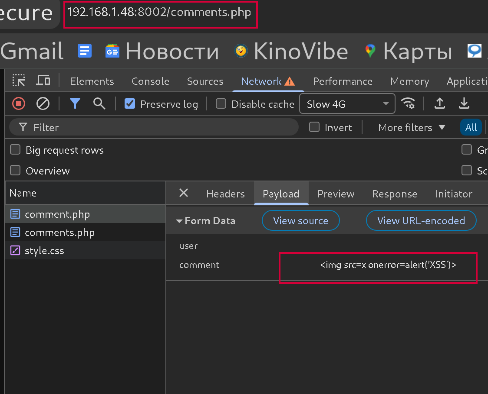
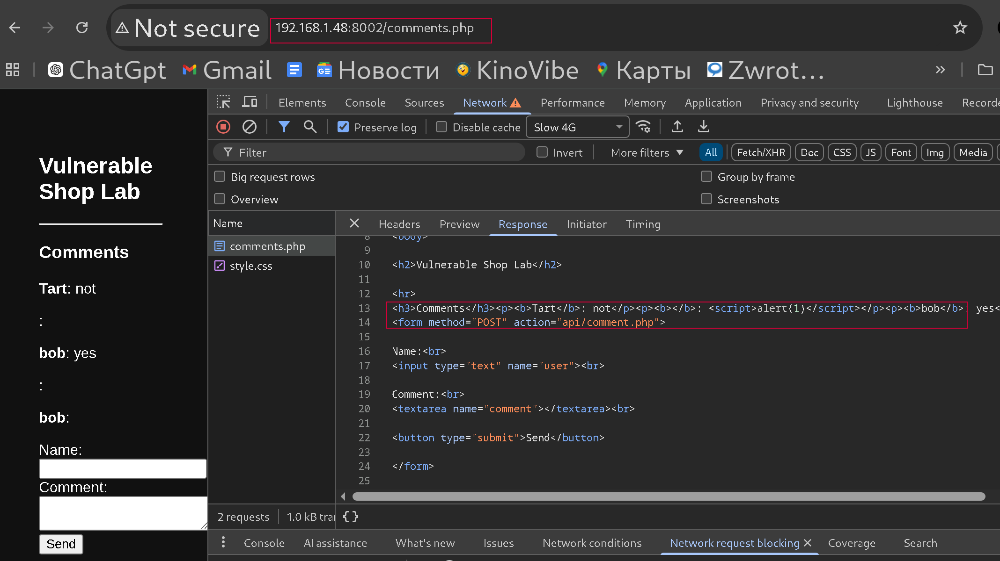
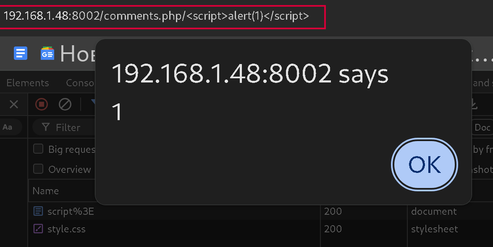
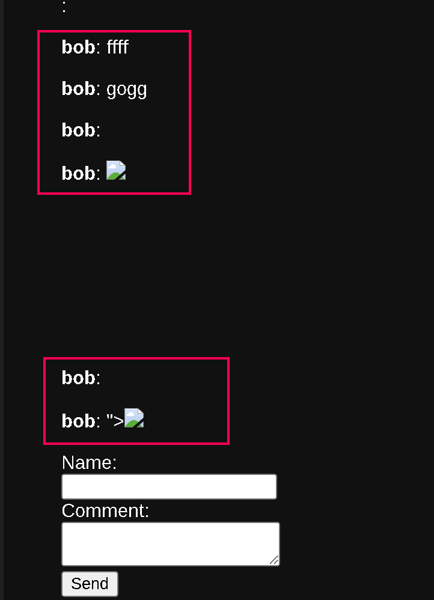
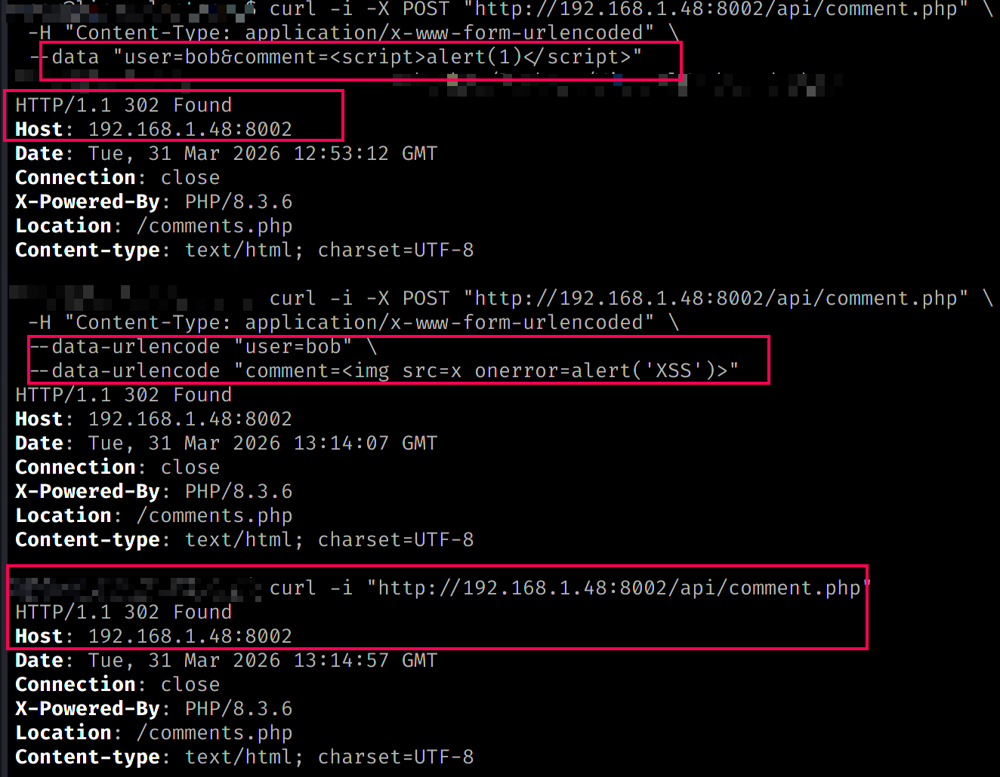
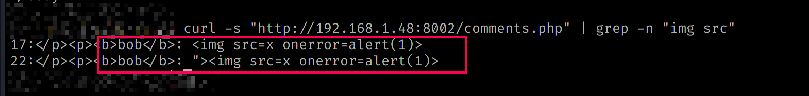
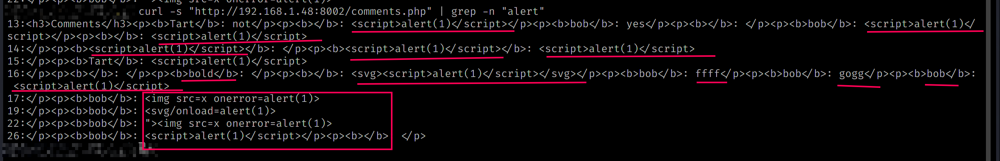
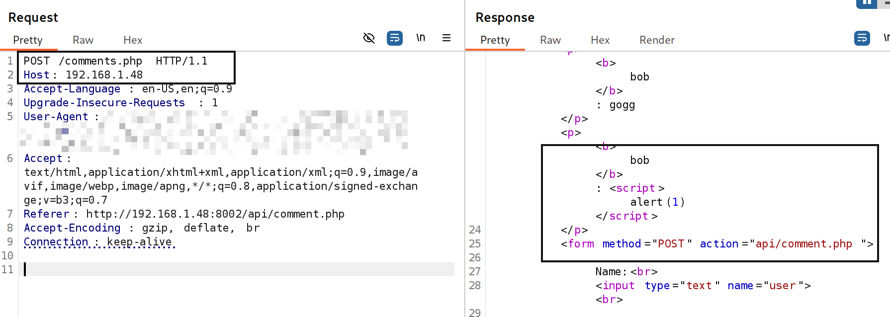
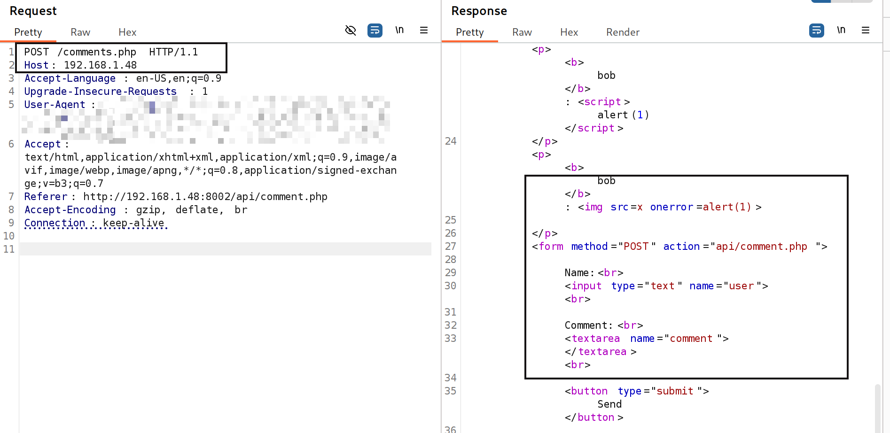
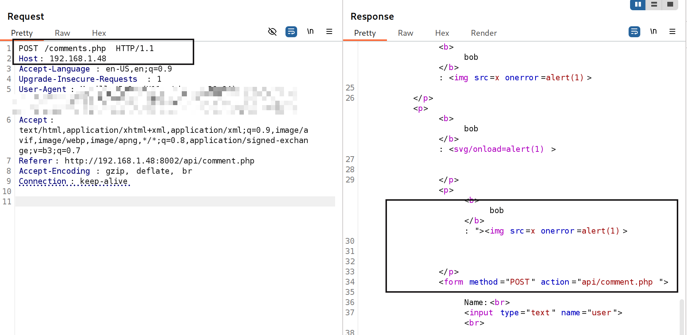

# Stored XSS in Public Comment Functionality

## 📌 Summary
A Stored Cross-Site Scripting (XSS) vulnerability was identified in the public comment functionality of the application.

User input is submitted to `/api/comment.php` and later rendered in `/comments.php` without sanitization, allowing arbitrary JavaScript execution in any user's browser.

The vulnerability is exploitable without authentication.

---

## 🎯 Affected Endpoints

- POST `/api/comment.php`
- GET `/comments.php`

---

## 🧪 Steps to Reproduce

1. Open the comments page:
http://192.168.1.48:8002/comments.php

2. Submit payload:

3. Request is sent to:
POST /api/comment.php

4. Reload the page

5. Payload executes in browser

---

## 💥 Payloads

Primary:

Secondary:

---

## 🔍 Proof of Concept

### Request
user=bob&comment=

### Response
<b>bob</b>: 

---

## 📸 Screenshots

### 1. Request

### 2. Payload injection

### 3. Unsanitized response

### 4. JavaScript execution

### 5. Stored XSS

### 6. curl exploitation

### 7. CLI verification (img payload)

### 8. CLI verification (alert)

### 9. Burp confirmation (script)

### 10. Burp confirmation (img)

### 11. Advanced payload

---

## ⚠️ Impact

- Arbitrary JavaScript execution
- Stored attack affecting all users
- Client-side compromise
- Phishing and defacement potential

Severity: High

---

## 🧠 Root Cause

User input is embedded into HTML without sanitization or output encoding.

---

## 🛠️ Remediation

- Apply output encoding (HTML escaping)
- Sanitize user input
- Use secure templating engines
- Implement Content Security Policy (CSP)

---

## ✅ Conclusion

The application is vulnerable to Stored XSS in a public, unauthenticated comment system.  
Any user can inject JavaScript that will execute in the browser of other users.
